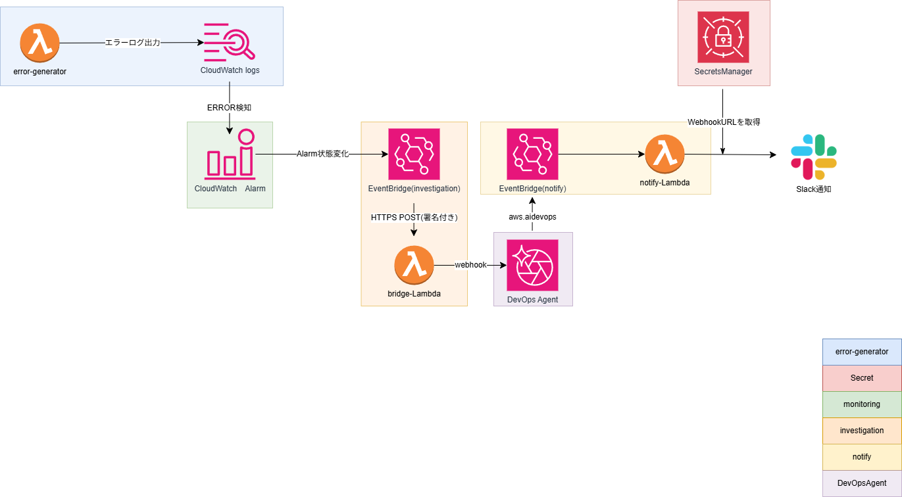
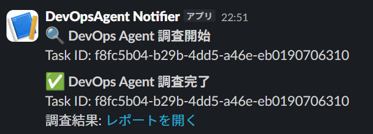

# DevOps Agent Investigation Pipeline

AWS DevOps Agent を活用したインシデント自動調査パイプラインの IaC 実装。  
CloudWatch アラーム発火を起点に、DevOps Agent への調査起票・Slack 通知までのパイプラインを Terraform で実装。

## アーキテクチャ



```
Lambda エラー発生
  → CloudWatch Logs（ERRORログ）
  → メトリクスフィルタ（ERROR検知 → ErrorCountメトリクス化）
  → CloudWatch Alarm（ErrorCount >= 1 で ALARM）
  → EventBridge（Alarm状態変化を検知）
  → investigation Lambda（DevOps Agent に調査起票）
  → DevOps Agent（自律調査・根本原因分析）
  → EventBridge（調査開始/完了イベント）
  → notify Lambda（Slack に通知）
```

## モジュール構成

```
modules/
├── secrets/          # Slack Webhook URL を Secrets Manager で管理
├── error-generator/  # 意図的にエラーを発生させる Lambda（テスト用）
├── monitoring/       # CloudWatch メトリクスフィルタ + アラーム
├── investigation/    # EventBridge ルール + bridge Lambda（調査起票）
└── notify/           # EventBridge ルール + notify Lambda（Slack 通知）
```

## 設計判断・技術的工夫

### ログメトリクスフィルタ方式を採用
Lambda の組み込みメトリクス（`AWS/Lambda Errors`）ではなく、CloudWatch Logs メトリクスフィルタでエラーを検知する方式を選択。理由は実務での汎用性が高いため。EC2・ECS・RDS など任意のログソースに対して同じパターンで監視を組める。

### `default_value=0` でデータ欠落による誤発火を防止
メトリクスフィルタに `default_value=0` を設定し、エラーが無い時もメトリクスが「0」として記録されるようにした。これにより、データ欠落時の CloudWatch アラームの状態振動を構造的に排除している。実務での CloudFront 5xxErrorRate 監視で欠落データによる状態振動を経験した教訓を設計に反映。

### AgentSpace ID を変数で受け取る設計
investigation モジュールは AgentSpace ID をハードコードせず、変数で受け取る設計にした。AgentSpace は用途・環境ごとに複数作成して使い分けるケースが想定されるため、`terraform.tfvars` の値を変えるだけで切り替えられる。また、AgentSpace 自体は Terraform ではなくコンソールで管理し、ID のみ参照する設計とした（awscc プロバイダーの安定性を考慮）。

### boto3 Lambda Layer で devops-agent クライアントを提供
Lambda 組み込みの boto3（1.42系）は `devops-agent` サービスモデルを含まないため、boto3 1.43.17 以降を Lambda Layer として作成・アタッチした。IAM アクションのサービスプレフィックスは `aidevops`（boto3 クライアント名の `devops-agent` とは異なる）。

### 調査起票 API は `create_backlog_task(taskType='INVESTIGATION')`
DevOps Agent の調査起票には `create_backlog_task` に `taskType='INVESTIGATION'` を指定する。`create_chat` はチャットセッションの作成であり、Investigation ライフサイクルイベント（EventBridge への通知）は発火しない。

## 使用技術

- Terraform 1.15.5
- AWS Lambda（Python 3.13）
- Amazon CloudWatch（Logs、メトリクスフィルタ、アラーム）
- Amazon EventBridge
- AWS Secrets Manager
- AWS DevOps Agent
- boto3 1.43.17（Lambda Layer）

## セットアップ手順

### 前提
- AWS CLI 設定済み
- Terraform インストール済み
- AWS DevOps Agent の AgentSpace を事前にコンソールで作成済み

### 手順

```bash
# 1. 変数ファイルを作成
cp terraform.tfvars.example terraform.tfvars
# terraform.tfvars を編集して値を設定

# 2. boto3 Lambda Layer を作成・公開（CloudShell 推奨）
mkdir -p boto3-layer/python
pip install boto3==1.43.17 -t boto3-layer/python --quiet
cd boto3-layer && zip -r ../boto3-layer.zip python && cd ..
aws lambda publish-layer-version \
  --layer-name boto3-devops-agent \
  --zip-file fileb://boto3-layer.zip \
  --compatible-runtimes python3.13 \
  --region us-east-1

# 3. Layer ARN を modules/investigation/main.tf の layers に設定

# 4. デプロイ
terraform init
terraform apply
```

## 動作確認結果

### エラー発生 → 調査起票
```bash
aws lambda invoke \
  --function-name devops-agent-error-generator \
  --region us-east-1 \
  --payload '{}' /tmp/response.json
```

約1分後、DevOps Agent に調査が自動起票される。

### DevOps Agent による根本原因分析（実際の出力）

> Lambda function 'devops-agent-error-generator' contains code at /var/task/index.py line 2 that unconditionally raises an exception. A CloudWatch Logs metric filter matches the pattern 'ERROR' and publishes a value of 1 to the 'ErrorCount' metric. This is an intentional test setup designed to validate the DevOps Agent alarm-to-investigation pipeline.

### Slack 通知
調査開始・完了時に Slack の #alert チャンネルへ自動通知。Task ID とレポートリンクを含む。

